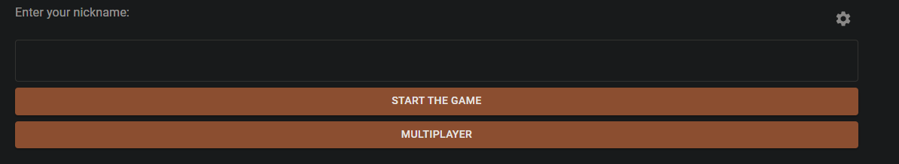
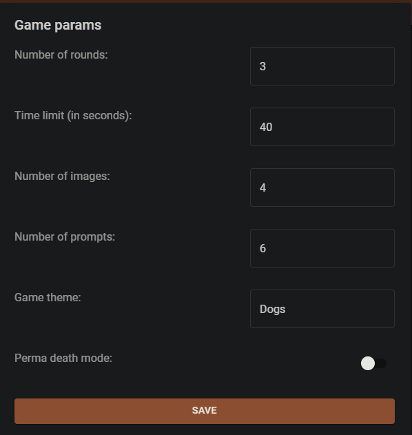
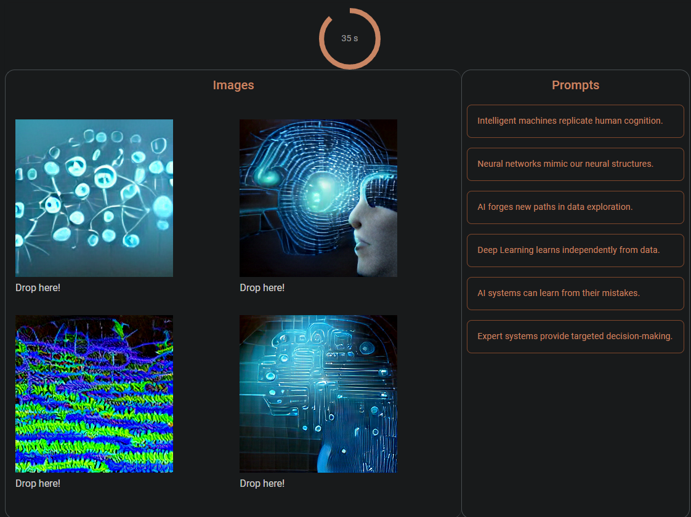

# IO-AGH-2023
This is a web application developed during the hackathon at AGH UST. The application is a game where the user must match an image to the prompt it was generated with. The prompts are generated using the ChatGPT API in the user's chosen theme. The images are generated locally using a DALL-E Mini model.

## Installation and Setup

To use the application, follow these steps:

1. Clone the repository to your local machine using `git clone https://github.com/username/projectname.git`.
2. Install Node.js on your machine. You can download it from the official website: https://nodejs.org/en/.
3. Install the required Node.js packages by running `npm install` from the project directory.
4. Start the application by running `npm start` from the project directory. The website should open automatically in your default browser. If it doesn't, you can manually access it at `http://localhost:3000`.
5. Run the `image_generator.py` script to generate the images. The generated images will be saved in the `photo-game-backend/images` directory.
6. Start the API server by running `uvicorn main:app` from the project directory.

## Usage

When you first access the application, you can choose your nick and start the game with default parameters or change them (We recommend experimenting with `Theme` option). Once you started a game, the application will generate a prompts according to the theme and then generate images using prompts. Your task is to match prompts to images by dragging them.

There is implemnted perma death mode which takes you to next round each time you match a prompt to a wrong image.

# Authors
An amazing team from AGH UST Computer Science students:
- [Mateusz Wejman](https://github.com/magdemajt)
- [Weronika Witek](https://github.com/wjwitek)
- [Bartłomiej Wiśniewski](https://github.com/Wisien999)
- [Bogusław Błachut](https://github.com/bblachut)
- [Jakub Sordyl](https://github.com/Mapet13)
- [Tobiasz Szulc](https://github.com/StormyData)
